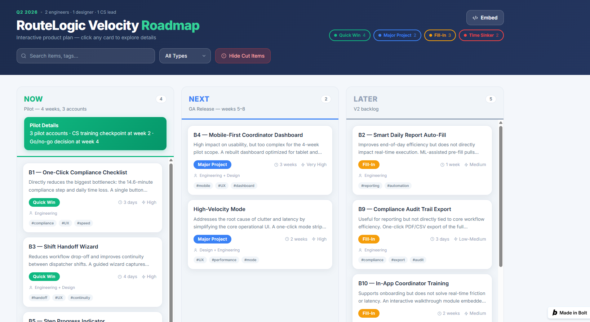

# # RouteLogic Velocity — Product Roadmap & Prioritization

> **Roadmap principle:** Prioritize the frontline execution problems most closely tied to trust, adoption, and at-risk account retention.

---

**[Explore Interactive Roadmap →](https://bolt.new/~/sb1-pxzxtfvc)**

## 12-Week Product Roadmap

### NOW — Validate the Core Execution Layer  
**Weeks 1–4 · 3 pilot accounts**

| Initiative | Why Now |
|---|---|
| **One-Click Compliance Checklist** | Directly targets a measurable workflow leak: only 48% complete past compliance |
| **Driver Alert Notifications** | Reduces the need for calls and WhatsApp during urgent changes |
| **Step Progress Indicator** | Makes core workflow state visible without adding new complexity |
| **Shift Handoff Wizard** | Reduces manual notes and fragmented exception context |

**Pilot checkpoints**
- Week 2: CS training and midpoint review
- Week 4: Go / iterate / kill decision
- Team: 2 engineers · 1 designer · 1 CS lead

---

### NEXT — Simplify the Daily Operating Experience  
**Weeks 5–8**

| Initiative | Why Next |
|---|---|
| **High-Velocity Mode / UI Simplification** | Extends the pilot learning into a cleaner frontline experience |
| **Mobile-First Coordinator Dashboard** | Improves access to the operational information coordinators use most often |

These are higher-effort changes, so they follow validation of the core workflow rather than leading it.

---

### LATER — Extend Value Without Reintroducing Clutter  
**Weeks 9–12+**

- Smart Daily Report Auto-Fill
- Compliance Audit Trail Export
- In-App Coordinator Training

These may add value, but they are not required to prove the core Velocity bet.

---

## Cut / Defer List

| Initiative | Decision | PM Rationale |
|---|---|---|
| **Contextual AI ETA Display** | Defer | No strong evidence that ETA prediction is the primary user problem or retention lever |
| **Fleet Analytics Manager View** | Defer | Useful for managers, but does not address the frontline execution crisis driving the 12-week roadmap |

> **PM judgment:** A feature can be relevant to logistics and still have no strategic right to consume engineering capacity now.

---

## How My PM Input Changed the Roadmap

The first-pass feature set was capability-heavy. I reprioritized it using the evidence from discovery and analytics.

| Initial Bias | PM Override |
|---|---|
| Add useful logistics features | Prioritize the broken Fleet Coordinator job-to-be-done |
| Treat all high-value ideas similarly | Separate urgent execution fixes from adjacent capability |
| Optimize for feature breadth | Optimize for trust, speed, and in-platform completion |
| Keep attractive AI/analytics ideas | Defer ideas without evidence of user or retention impact |

**Result:** the roadmap moved from a feature list to a sequence of bets tied to measurable user and business outcomes.

---

## From Roadmap to Execution

The highest-priority roadmap bet is the **One-Click Compliance Checklist** because it directly targets the measurable compliance workflow leak.

The detailed scope, behaviors, edge cases, and prototype are documented separately:

**[View Scoped PRD & Prototype →](prd-and-prototype.md)**

This separation keeps the roadmap focused on **what earns investment and when**, while the PRD defines **what gets built and how the product should behave**.

---
---

## Strategic Takeaway

> **The roadmap protects focus by sequencing the work around the product crisis, not around the size of the backlog.**

Velocity starts by proving that RouteLogic can restore frontline execution trust before investing in broader experience redesign or adjacent capability.
