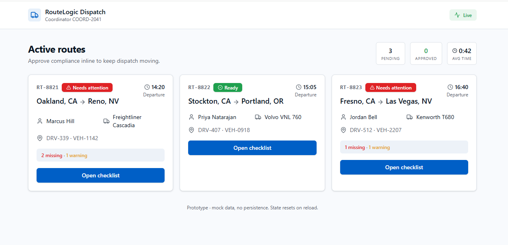

# RouteLogic Velocity

### B2B SaaS Product Strategy · Discovery · Experimentation · GTM

> **Restore frontline execution trust before adding more product complexity.**

RouteLogic had built deep enterprise logistics capability, but frontline teams were increasingly leaving the platform to complete time-critical work through WhatsApp, Google Maps, calls, spreadsheets, and screenshots.

**My product decision:** simplify the execution layer while preserving enterprise capability in the background.

### Executive Recommendation

Run a **4-week Velocity pilot across 3 enterprise accounts**, starting with a One-Click Compliance workflow and a pre-defined **ship / iterate / kill** decision.

| **8–15 min** | **20–60 min** | **48% → 63%** | **4 weeks** |
|---|---|---|---|
| Route reassignment delay | Driver-status lag | Completion target | Decision window |

**[View Executive Board Pitch →](https://malihajahan-collab.github.io/RouteLogic-product-management/)**  
**[Try Live Prototype →](https://preview--swift-check-approve.lovable.app/)** · **[Explore Roadmap →](https://bolt.new/~/sb1-pxzxtfvc)**

> **Product thesis:** RouteLogic became powerful by adding more. Velocity tests whether it can become more valuable by knowing what to remove.

---

## The Product Problem

The core issue is not lack of functionality.

It is **loss of operational trust**.

When coordinators cannot rely on RouteLogic during time-critical work, they create a parallel operating system outside the product.

**Reliability + complexity → off-platform work → lower trust → weaker adoption → higher renewal risk**

### Primary User

**Fleet Coordinator / Dispatcher**

**Goal:** Make accurate, time-critical dispatch decisions from one trusted system.

**Moment of misery:** The coordinator has already made a decision but cannot trust RouteLogic to communicate or reflect it quickly enough.

---

## My Product Decision

Instead of adding more frontline capability, I prioritized **strategic subtraction**:

- simplify critical workflows
- surface exceptions instead of re-confirming known information
- preserve enterprise controls in the background
- defer features that do not directly improve speed, trust, or retention risk

The first validation feature is the **One-Click Compliance Checklist**.

---

## Prototype

### One-Click Compliance Checklist

The prototype tests whether compliance can remain rigorous while requiring fewer interactions.

**[View Live Prototype →](https://preview--swift-check-approve.lovable.app/)**

> **Product principle:** One click reduces interaction cost. It does not remove validation.

---

## Roadmap

The roadmap is sequenced around the product crisis rather than the size of the backlog.

**[Explore Interactive Roadmap →](https://bolt.new/~/sb1-pxzxtfvc)**

### NOW — Prove execution value
- One-Click Compliance Checklist
- Driver Alert Notifications
- Step Progress Indicator
- Shift Handoff Wizard

### NEXT — Simplify daily operations
- High-Velocity Mode
- Mobile-First Coordinator Dashboard

### LATER — Extend without reintroducing clutter
- Smart Daily Report Auto-Fill
- Compliance Audit Trail Export
- In-App Coordinator Training

> **Prioritization decision:** Defer attractive features that do not directly improve speed, operational trust, or retention risk.
---

## Experiment

**Hypothesis:** Simplifying the compliance workflow will increase in-platform completion for Fleet Coordinators.

| Metric | Target |
|---|---:|
| Workflow completion past compliance | **48% → 63%** |
| Minimum Detectable Effect | **+15 percentage points** |
| Compliance step time | **14.6 min → ≤10 min** |
| GPS accuracy guardrail | **≥95%** |
| Driver-status sync errors | **≤2%** |
| Decision window | **4 weeks** |

**Decision rule:** Ship only if the improvement clears the pre-defined threshold and guardrails remain intact.

---

## Business Outcome

The business-level North Star is **at-risk account retention**.

A four-week product experiment cannot credibly prove retention impact, so the strategy uses controllable leading signals:

**Higher in-platform completion → fewer workarounds → stronger operational trust → stronger renewal case**

---

## Go-to-Market

Velocity is positioned as a **retention strategy**, not a feature campaign.

**Primary audience:** Fleet Coordinators and Dispatch Leads  
**Secondary audience:** VP Operations / Logistics Leaders

**Launch approach:**
- pilot with 3 enterprise accounts
- build before/after evidence
- activate Customer Success and Sales
- expand only after the pilot supports the product bet

---

## Executive Board Pitch

**View the board presentation:**  
https://malihajahan-collab.github.io/RouteLogic-product-management/

The presentation summarizes the recommendation, investment, roadmap, experiment, and executive decision required.

---

## Case Study Artifacts

| Area | Artifact |
|---|---|
| Product framing | [`01-product-thinking/problem-hook.md`](01-product-thinking/problem-hook.md) |
| PM prioritization | [`01-product-thinking/strategic-prioritization-pm-judgment.md`](01-product-thinking/strategic-prioritization-pm-judgment.md) |
| Product health diagnosis | [`02-discovery/product-health-diagnosis.md`](02-discovery/product-health-diagnosis.md) |
| Competitive workarounds + future journey | [`02-discovery/competitive-workarounds-and-future-journey.md`](02-discovery/competitive-workarounds-and-future-journey.md) |
| Metric strategy + business linkage | [`03-analytics/metric-strategy.md`](03-analytics/metric-strategy.md) |
| Product roadmap & prioritization | [`04-roadmap/product-roadmap.md`](04-roadmap/product-roadmap.md) |
| Scoped PRD + prototype | [`04-roadmap/prd-and-prototype.md`](04-roadmap/prd-and-prototype.md) |
| Experimentation plan | [`05-experimentation/experimentation-plan.md`](05-experimentation/experimentation-plan.md) |
| GTM + success dashboard | [`06-launch/gtm-and-dashboard.md`](06-launch/gtm-and-dashboard.md) |

---

## PM Takeaway

> **AI accelerated synthesis and execution. Product judgment determined the problem, trade-offs, scope, metrics, and decision criteria.**

The most important shift in this case was moving from **“what feature should we build?”** to **“what evidence is strong enough to justify investment?”**
